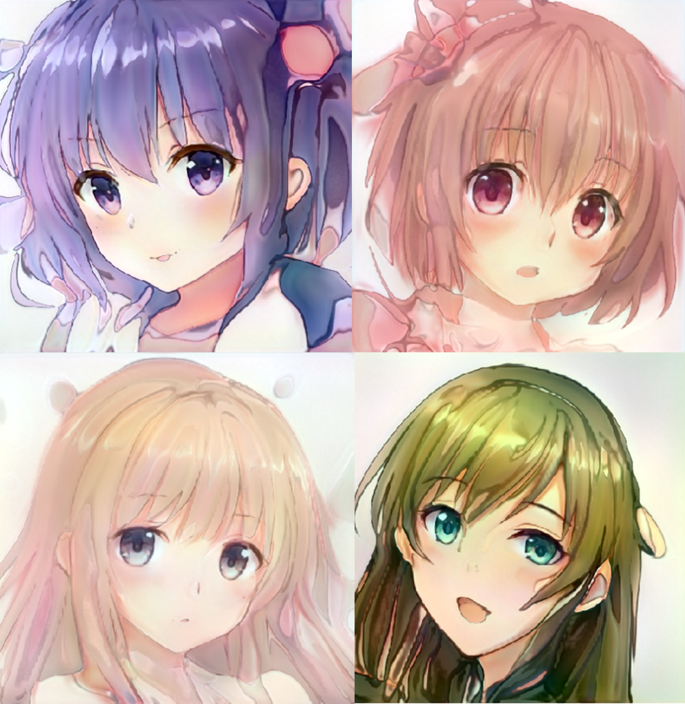
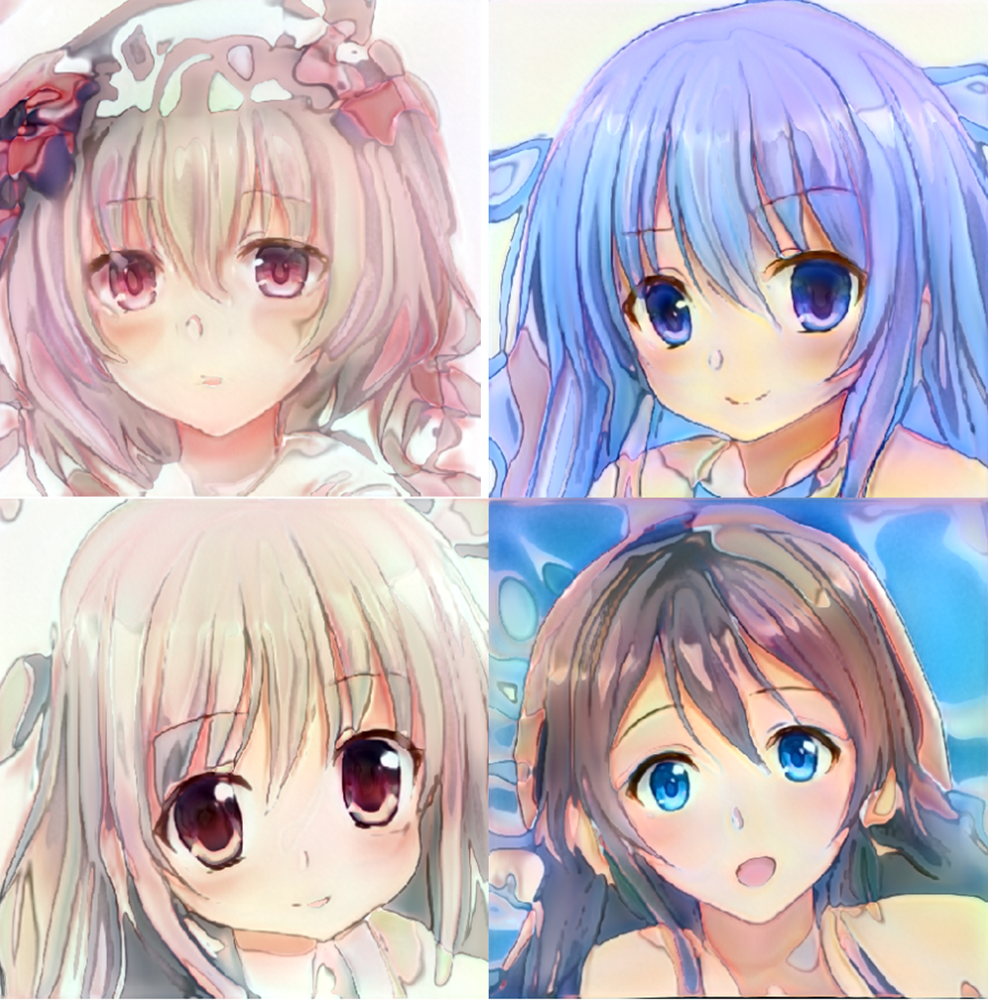
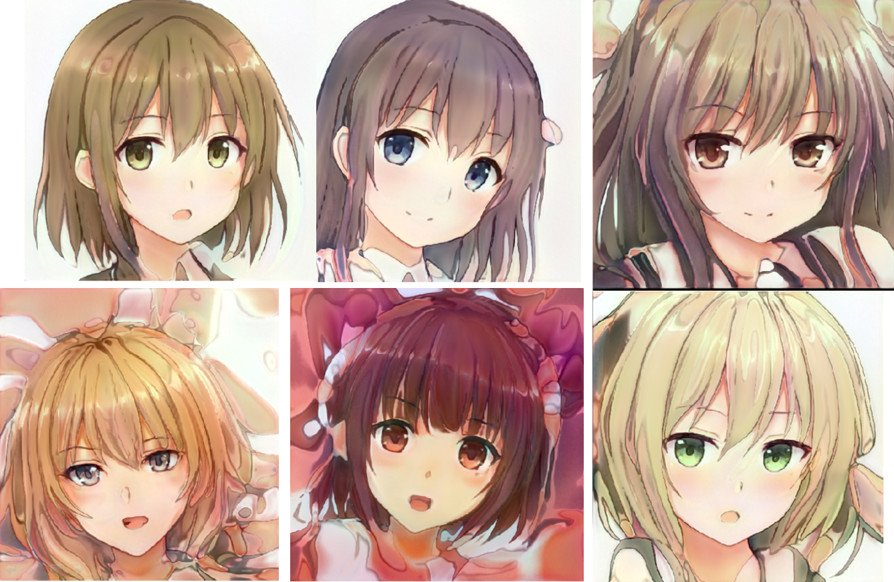
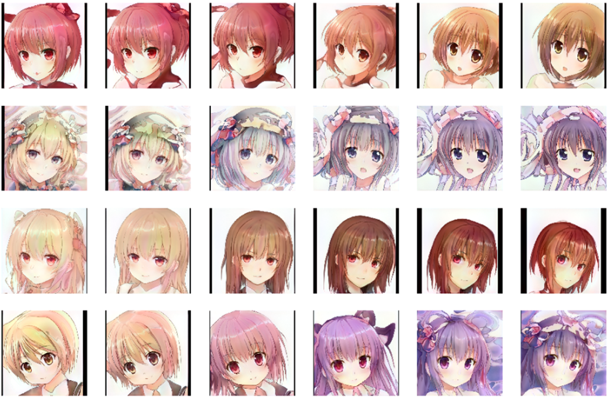
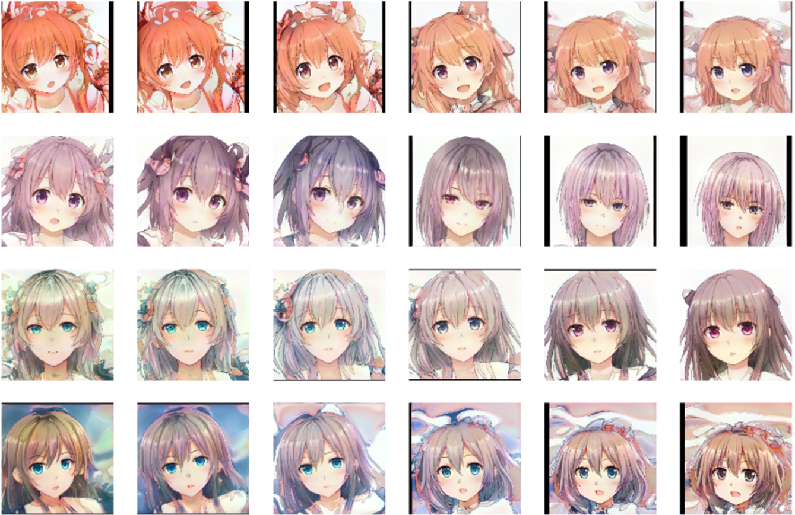

## Style_GAN2_TWDNE (This Waifu Does not exist)

  

Tensorflow 2.1 implementation for NVIDIA style GAN2  
  
  
  
  
  

----
## Implementation detail  
The virtual Waifu picture is generate by AI using NVIDIA famous style GAN2 algorithm. The training set is composed of 2500 images generated by TWDNE website.

----
## Reference
> Style GAN2 paper: https://arxiv.org/abs/1912.04958 
> TWDNE website: https://www.thiswaifudoesnotexist.net/
> Style GAN2 for HD fake human face: https://github.com/RyanWu2233/Style_GAN2_FFHQ
> NVIDIA official source code: https://github.com/NVlabs/stylegan2

